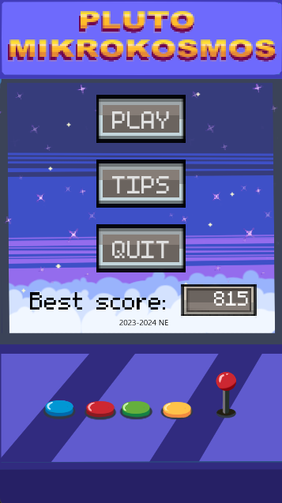
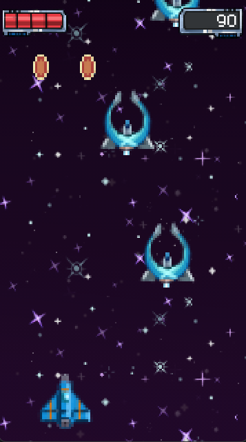

# Pluto Mikrokosmos

**Pluto Mikrokosmos** is a simple game developed using ``Godot 4.3.stable``. Inspired by the classic *Space Invaders*, this game offers a nostalgic experience with modern enhancements. Players take control of a spaceship, battling waves of enemies in space with the goal of surviving as long as possible.

## The Game

In *Pluto Mikrokosmos*, players face an endless onslaught of alien invaders. With time the enemies become more challenging, testing the player’s reflexes and strategic thinking.

| Start Screen |        | Playing Screen |
|----------|--------|----------|
|  |  |  |

## Illustrations

All illustrations are created by:

- [@Melissa Francielle](https://github.com/Melissa-Francielle)
